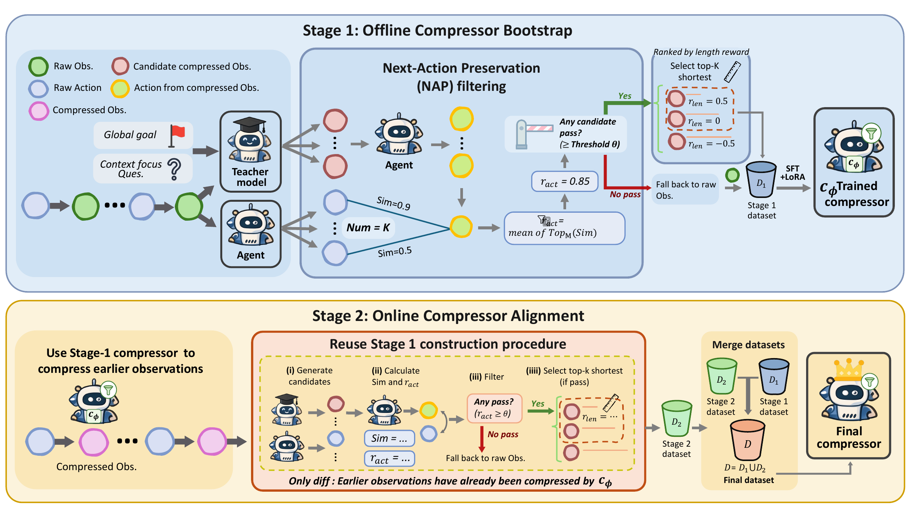
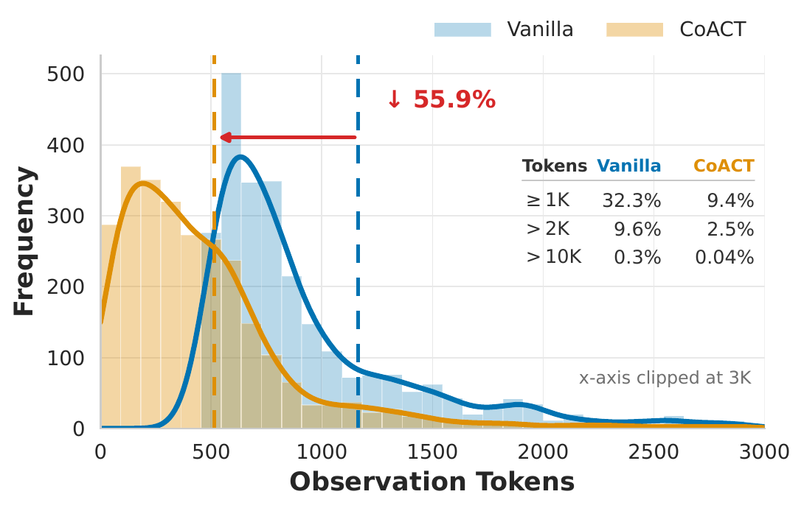
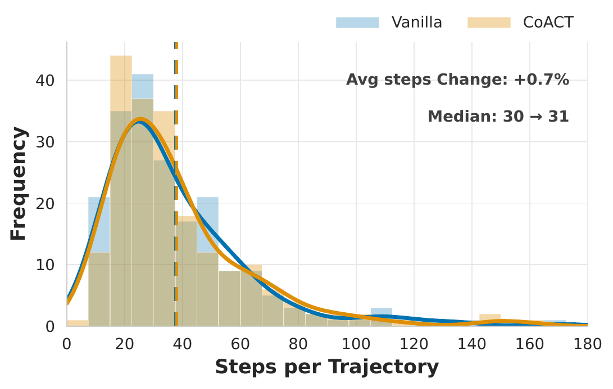
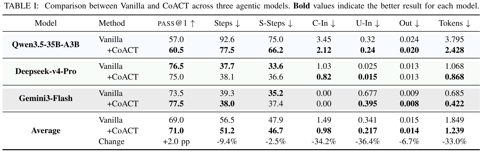

# CoACT: Action-Preserving Observation Compression for Coding Agents

Official implementation of our paper "CoACT: Action-Preserving Observation Compression for Coding Agents".

## News

- **[Jul, 2026]**: We released the code for CoACT.

## Overview

LLM-based coding agents solve software-engineering tasks through iterative interaction with a development environment. At each step, the agent issues an action, receives an observation, and appends that observation to its context. As this loop continues, observations accumulate quickly and become a major source of inference cost: in our analysis, observation tokens account for **45.7%** of total token consumption on SWE-bench Verified and up to **67.8%** on Terminal-Bench.

Observation compression reduces this cost by shortening observations before they enter the agent context. However, existing compression methods still struggle with the efficiency-effectiveness trade-off. Some methods preserve task-solving effectiveness but leave substantial token savings unrealized; others compress aggressively but remove information the agent still needs, causing lower pass@1 or extra recovery steps.

This motivates the central objective behind **CoACT**: minimize total token consumption while keeping the compressed agent close to the uncompressed agent in task-solving effectiveness. Directly enforcing this objective with final pass@1 is impractical, because pass@1 is only known after the whole trajectory finishes and gives sparse feedback over many compression decisions.

CoACT therefore uses **next-action preservation (NAP)** as a practical proxy. If replacing a raw observation with a compressed one induces the same next action, the compression likely preserves the information needed for the agent to continue solving the task. NAP is cheap enough to evaluate at each step and dense enough to guide compressor training.



Based on NAP, CoACT trains a lightweight observation compressor with reward-selected supervision. A teacher model first generates multiple compression candidates for each observation. CoACT then selects candidates using two complementary rewards:

- **Action-preservation reward** - keeps candidates that satisfy the NAP constraint by preserving the agent's next action.
- **Length-reduction reward** - among action-preserving candidates, prefers compact outputs that remove more tokens.

The selected examples are used for offline bootstrap and online alignment. During deployment, only the trained compressor is inserted into the agent workflow, so CoACT shortens each new observation before it enters the trajectory while preserving valuable prefix KV-cache reuse.



On SWE-bench Verified, CoACT reduces average total token consumption by **33.0%** across three agentic models while keeping task-solving effectiveness close to the uncompressed agent. For Qwen3.5-35B-A3B, CoACT reduces total tokens from **3.795M** to **2.428M** per instance and improves pass@1 from **57.0%** to **60.5%**.



The project includes:

- **Agent runner** - Mini-SWE-Agent integration and trajectory parsing.
- **Compression training** - prompt construction, candidate sampling, action-preservation rewards, length rewards, and rollout selection.
- **Evaluation harness** - SWE-bench Verified evaluation, cost tracking, run management, and metric aggregation.
- **Baselines** - vanilla, sliding window, AgentDiet, SWE-Pruner, LLMLingua-2, LongCodeZip, CoACT, sliding_window_CoACT, and agentdiet_CoACT.
- **vLLM services** - serving scripts for the agent model, CoACT compressor, and compression baselines.

## Directory Structure

```text
CoACT/
├── config/
│   ├── config.yaml                  # Unified configuration for models, data, training, evaluation, and pricing
│   └── accelerate_config.yaml       # Multi-GPU training config
├── scripts/
│   ├── collect_trajectories.py      # Collect raw SWE-smith trajectories
│   ├── prepare_data.py              # Build off-policy SFT data with reward-guided candidate selection
│   ├── prepare_dagger_data.py       # Build online-alignment examples from CoACT deployment trajectories
│   ├── train_sft.py                 # Train the LoRA compressor with TRL SFTTrainer
│   ├── merge_lora.py                # Merge LoRA adapters into the base compressor model
│   ├── evaluate.py                  # Evaluate strategies on SWE-bench Verified
│   └── vllm/
│       ├── serve_agent.sh           # Serve the coding agent model
│       ├── serve_compressor_lora.sh # Serve the trained CoACT compressor
│       ├── serve_swepruner.sh       # Serve SWE-Pruner baseline
│       ├── serve_llmlingua2.sh      # Serve LLMLingua-2 baseline
│       └── serve_longcodezip.sh     # Serve LongCodeZip baseline
├── src/
│   ├── agent/                       # Mini-SWE-Agent runner and trajectory parsing
│   ├── compression/                 # Data preparation, prompt context, rewards, and rollout selection
│   ├── config/                      # Typed configuration loading and prompt templates
│   ├── eval/                        # Compression strategies, runner, metrics, and SWE-bench harness
│   ├── reward/                      # Bash/action similarity and length reward
│   └── utils/                       # Shared helpers
├── tests/                           # Unit and integration tests
├── external_libs/SWE-Bench/         # SWE-bench submodule
├── assets/                          # README figures
├── pyproject.toml
└── README.md
```

## Environment Setup

Clone the repository with submodules:

```bash
git clone --recurse-submodules https://github.com/Kndy666/CoACT.git
cd CoACT
```

If the repository was cloned without submodules, initialize them with:

```bash
git submodule update --init --recursive
```

CoACT uses two separate Python environments:

```bash
# Evaluation, trajectory collection, tests, linting, and local serving
bash scripts/sync_vllm_env.sh

# Training and LoRA merge workflows
bash scripts/sync_training_env.sh
```

The sync scripts use `uv` and create `.venv-vllm` and `.venv-training` respectively.

### API Keys and Endpoints

Configure model endpoints and keys in `config/config.yaml`.

- `agent` controls the coding-agent model endpoint.
- `sft.rollout` controls the teacher model used for compression candidate generation.
- `evaluation.coact` controls the trained CoACT compressor endpoint.
- `pricing` stores per-token prices in USD for evaluation cost accounting.

For local OpenAI-compatible model servers, update the corresponding `api_endpoint` fields. For hosted providers, set API keys either in `config/config.yaml` or through the provider environment variables expected by LiteLLM.

## Usage

### 1. Collect raw trajectories

Use `.venv-vllm` for trajectory collection:

```bash
.venv-vllm/bin/python scripts/collect_trajectories.py \
    --config config/config.yaml \
    --max-trajectories 50 \
    --max-workers 1
```

Trajectories are written to `data/trajectories/` by default.

### 2. Build reward-selected SFT data

Generate compression candidates, infer next actions, compute action-preservation and length rewards, and save selected examples:

```bash
.venv-vllm/bin/python scripts/prepare_data.py \
    --config config/config.yaml \
    --compression-max-workers 8 \
    --inference-max-workers 4 \
    --step-max-workers 1
```

For online alignment, first run CoACT to collect deployment trajectories with compressed observations, then construct online-aligned training examples:

```bash
.venv-vllm/bin/python scripts/prepare_dagger_data.py \
    --config config/config.yaml \
    --compression-max-workers 8 \
    --inference-max-workers 8 \
    --step-max-workers 1
```

### 3. Train the compressor

Use `.venv-training` for SFT:

```bash
# Single GPU
.venv-training/bin/python scripts/train_sft.py --config config/config.yaml

# Multi-GPU
UV_PROJECT_ENVIRONMENT=.venv-training accelerate launch \
    --config_file config/accelerate_config.yaml \
    scripts/train_sft.py --config config/config.yaml
```

The trainer reads JSONL files listed under `sft.data_file` and saves checkpoints under `checkpoints/`.

### 4. Merge and serve the compressor

Merge a trained LoRA adapter into the base model:

```bash
.venv-training/bin/python scripts/merge_lora.py \
    --base-model model/Qwen3.5-4B \
    --adapter checkpoints/sft/<run>/final \
    --output checkpoints/merged/Qwen3.5-4B-sft-merged
```

Serve the agent and compressor with OpenAI-compatible endpoints. The provided scripts are examples. You should adjust model paths, ports, and `config/config.yaml` to match your environment.

```bash
bash scripts/vllm/serve_agent.sh
bash scripts/vllm/serve_compressor_lora.sh
```

### 5. Evaluate on SWE-bench Verified

Evaluate baselines and CoACT with `.venv-vllm`:

```bash
# Uncompressed reference
.venv-vllm/bin/python scripts/evaluate.py \
    --strategy vanilla \
    --max-instances 50 \
    --trajectory-max-workers 1

# CoACT observation compression
.venv-vllm/bin/python scripts/evaluate.py \
    --strategy CoACT \
    --max-instances 50 \
    --trajectory-max-workers 1

# AgentDiet + CoACT
.venv-vllm/bin/python scripts/evaluate.py \
    --strategy agentdiet_CoACT \
    --max-instances 50 \
    --trajectory-max-workers 1
```

Evaluation outputs are written under `data/eval/runs/`, including trajectories, summaries, SWE-bench predictions, and harness reports.

## Strategies

| Strategy | Description |
| --- | --- |
| `vanilla` | Run the agent with raw observations. |
| `sliding_window` | Keep only the most recent trajectory window. |
| `agentdiet` | Use AgentDiet trajectory compression. |
| `CoACT` | Compress each new observation with the trained CoACT compressor. |
| `sliding_window_CoACT` | Apply CoACT observation compression before sliding-window trajectory compression. |
| `agentdiet_CoACT` | Apply CoACT observation compression before AgentDiet trajectory compression. |
| `swepruner` | Query-aware line pruning baseline. |
| `llmlingua2` | Task-agnostic token-classification compression baseline. |
| `longcodezip` | Query-aware code-compression baseline. |

## Results Snapshot

The paper evaluates CoACT on SWE-bench Verified with mini-swe-agent. The RQ1 table below reports pass@1, interaction steps, and token consumption across three agentic models.



## Benchmarks and Data

- **Training data**: SWE-smith trajectories are used to construct compressor supervision.
- **Evaluation benchmark**: SWE-bench Verified.
- **Agent scaffold**: mini-swe-agent with a bash-only environment interface.
- **Compressor base model**: Qwen3.5-4B with LoRA SFT.

## Development

Use `.venv-vllm` for tests and linting:

```bash
.venv-vllm/bin/python -m pytest
.venv-vllm/bin/python -m ruff check src scripts tests
```
